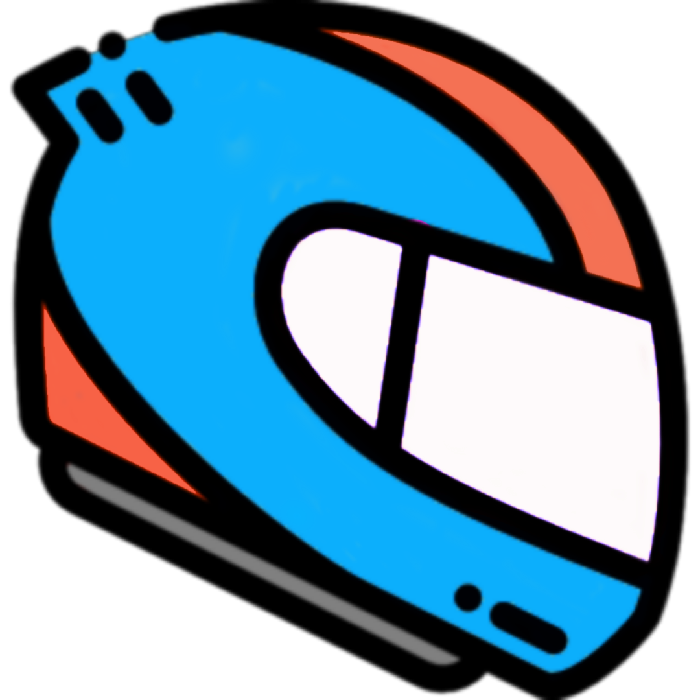

<!-- markdownlint-disable MD001 MD028 MD033 MD059 -->

# ‮‭ ‮‭ [](/Resources/Images/l'Mao/wink-mr-bean.gif_-_tenor.gif) KBDRacer2x2 <i>SuperSpeed</i>   

> "I'm sorry, Dave, but as an AI language model, <i>I can't even<b>-</i></b><i>...However, I can surely odd.</i> P.S. Don't call me "[Shirley](https://youtu.be/ixljWVyPby0?t=63)."

‮‭

Like its predecessors, <b>[KBDRacer](https://www.github.com/ccelik97/KBDRacer) <b>&</b> [KBDRacer2](https://www.github.com/ccelik97/KBDRacer-ElectricBoogaloo),</b> KBDRacer2x2, too, aims to provide a more agile, yet, more detailed racing game control scheme than; while still remaining at least as ergonomic as: <b>"[WASD.](/Resources/Images/l'Mao/WASD.png)"</b>

#### <b>The main idea is to <i>minimize the need for "key releases"</i> when it comes to the reflexive, urgent inputs.</b>

## Getting Started

1. Install [<b>vJoy</b>](https://www.vjoy.org/download-for-windows), and have at least the "vJoy Device #1" created, working.

2. Install [<b>.NET 8.0</b>](https://dotnet.microsoft.com/en-us/download) or higher.

3. Extract the <code>KBDRacer2x2.exe</code> file and run it.

> [!NOTE]
>
> - The linked <b><u>vJoy</u></b> installer above <b><u>supports Windows 11 too</u></b>, yes.
>
> - Once running, it will create a <i>System Tray</i> icon. —Right click on it -> "Exit" to exit.
>
> - Run it as Administrator if your game is also running as Administrator.
>
> 

> 
<i>Additionally,</i>

>
> <h4>In-Game Input Configuration</h4>
>
> - As this script is for controlling the <b>"vJoy Device #1"</b>, you should have that device among your gamepad/joystick inputs in your game: <b>Configure <i>that</i> there, not the in-game keyboard inputs!</b>
>
> - Curious why the <code>Ry</code>, <code>Rx</code>, <code>X</code> axes? 👉 See: <b>[AXES](/Docs/AXES.md)</b>🪓🪓🪓
>
> 

## Usage

See: <b>[USAGE](/Docs/USAGE.md)</b>

## Download

See: <b>[RELEASES](https://github.com/ccelik97/KBDRacer2x2-SuperSpeed/releases)</b>

> [!IMPORTANT]
>
> <b>Run it as Administrator if your game is also running as Administrator.</b>

> [!TIP]
>
> You can use <i>Task Scheduler</i> for this, and create a <i>Desktop Shortcut</i> for the task, too, btw. 👉 Click <b>[here](/Docs/l'Mao/iElevator™.md)</b> for how.

## Greetings

- <b>[evilC](https://github.com/evilC) - <code>[AHK-CvJoyInterface](https://github.com/evilC/AHK-CvJoyInterface)</code></b>

- <b>[Google Gemini](https://google.gemini.com)</b> - <i>Yes,</i> for real[.](https://aistudio.google.com/) Dude, <i><u>it</u> developed<b>[<code>vJoyMMFServer</code>](https://github.com/ccelik97/vJoyMMFServer)</b>. (I just helped.)</i>
